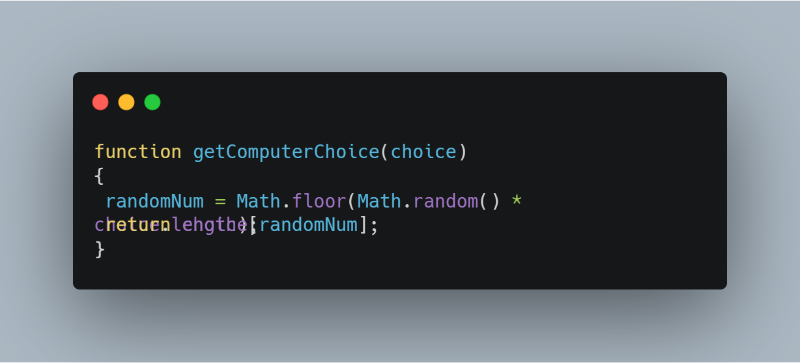
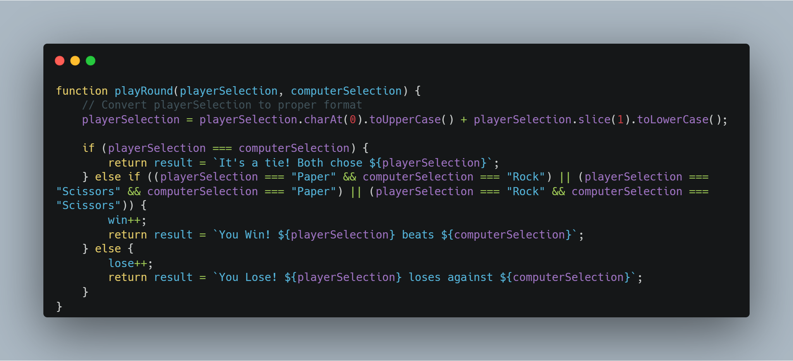
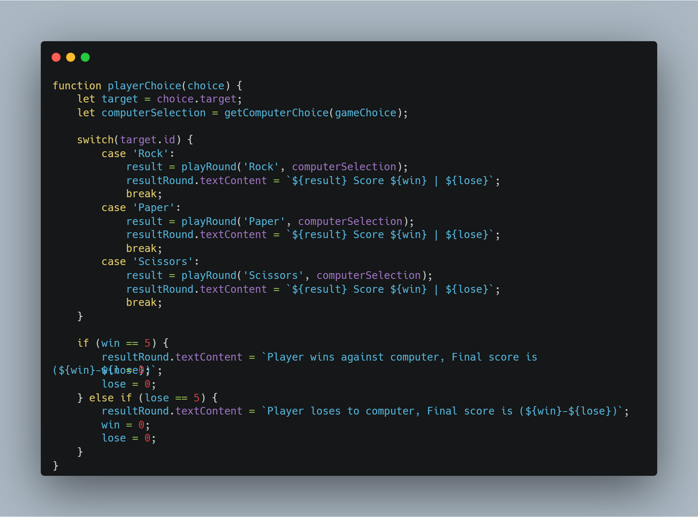

# ODIN Project: Rock Paper Scissors

##  Description: 
This project is a simple implementation of the classic game "Rock Paper Scissors" in JavaScript. It allows a player to compete against a computer opponent. The game is played through a series of rounds, and the winner is determined by the choices made by the player and the computer.

##  Functions:
### getComputerChoice(choice)

This function takes an array `choice` representing the possible choices and returns a randomly selected choice from the array.

### playRound(playerSelection, computerSelection)

This function simulates a single round of the game. It takes playerSelection (the player's choice) and computerSelection (the computer's choice) as arguments and determines the winner based on the game's rules.

### playerChoice(choice)

This function is called when the player makes a choice (clicks a button). It determines the computer's choice, plays a round, updates the score, and checks for the end of the game.

##  Usage:
- Ensure that you have JavaScript enabled in your browser or use a JavaScript runtime environment such as Node.js to execute the code.
- Simply run the script containing the provided code to start the game.
- Select a button of your choice (rock, paper, or scissors) for each round.

##  Notes:
- The game continues until the player or computer reaches a score of 5 wins.
- The player's choices are case-insensitive.